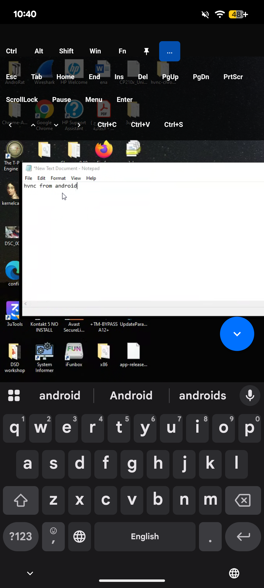

# rustdesk-hvnc

`rustdesk-hvnc` is a Windows hidden-desktop client based on RustDesk. It captures a separate Windows desktop and forwards video, keyboard, and mouse events through the standard RustDesk protocol, allowing an official RustDesk client to connect through a self-hosted RustDesk server.

> Use this software only on systems you own or are explicitly authorized to administer.

## Current fixes

- Android software-keyboard input, control keys, modifiers, shortcuts, and function keys
- Hidden-desktop input-thread binding
- Full-content GDI capture for browser and application windows
- Chromium Direct3D child-window mouse routing
- Reliable Chromium menu and submenu clicks with and without GPU acceleration

## Components

- **Windows host:** this repository, built as `rustdesk.exe`
- **Server:** the official open-source `hbbs` and `hbbr` binaries
- **Controller:** an official RustDesk desktop or Android client

## Screenshots




## Clone

```bat
git clone git@github.com:dr1408/rustdesk-hvnc.git
cd rustdesk-hvnc
```

## Build on Windows x64

### Prerequisites

Install Git, Rust through [rustup](https://rustup.rs/), Visual Studio Build Tools with **Desktop development with C++** and the Windows SDK, CMake, and Ninja.

Install the MSVC Rust toolchain:

```bat
rustup toolchain install stable-x86_64-pc-windows-msvc
rustup default stable-x86_64-pc-windows-msvc
```

The verified build used Rust 1.90.0 and Cargo 1.90.0.

### Install vcpkg dependencies

Keep vcpkg inside the repository so the build is self-contained:

```bat
git clone https://github.com/microsoft/vcpkg vcpkg
vcpkg\bootstrap-vcpkg.bat
set VCPKG_ROOT=%CD%\vcpkg
vcpkg\vcpkg.exe install libvpx:x64-windows-static libyuv:x64-windows-static opus:x64-windows-static aom:x64-windows-static
```

The repository's `.cargo/config.toml` enables the static MSVC runtime. vcpkg installs supporting packages such as zlib automatically when required.

Set `VCPKG_ROOT` again in each new Command Prompt, or persist it once:

```bat
setx VCPKG_ROOT "%CD%\vcpkg"
```

Open a new terminal after using `setx`.

### Build

From the repository root:

```bat
set VCPKG_ROOT=%CD%\vcpkg
rustup run stable cargo build --release --bin rustdesk
```

The resulting executable is `target\release\rustdesk.exe`.

Incremental rebuilds do not require `cargo clean`. Use `cargo clean` only when changing toolchains, native dependencies, or troubleshooting stale build artifacts.

## Run the RustDesk server

The server can run on Linux ARM64 or x86_64. Obtain compatible `hbbs` and `hbbr` binaries from the official [rustdesk-server](https://github.com/rustdesk/rustdesk-server) project, then place both in one writable directory.

Run each service in a separate terminal. Replace `SERVER_IP` with the Linux server's LAN address.

Terminal 1:

```sh
cd /path/to/rustdesk-server
./hbbr
```

Terminal 2:

```sh
cd /path/to/rustdesk-server
./hbbs -r SERVER_IP:21117
```

Both processes are recommended:

- `hbbs` provides ID registration and rendezvous on TCP/UDP 21116.
- `hbbr` relays sessions on TCP 21117 when a direct connection is unavailable.

Additional default ports are TCP 21115 for NAT testing and TCP 21118/21119 for WebSocket connections. Allow ports 21115-21119 as required by your network configuration.

On first launch, `hbbs` creates `id_ed25519` and `id_ed25519.pub`. Configure clients with the public key:

```sh
cat id_ed25519.pub
```

Never publish or share `id_ed25519`, the private key.

## Start the Windows HVNC host

Choose a unique numeric connection ID and run:

```bat
target\release\rustdesk.exe SERVER_IP CONNECT_ID
```

Example:

```bat
target\release\rustdesk.exe 192.168.1.10 222333
```

Keep that terminal running while using the remote session.

## Configure the controlling client

In the official RustDesk Android or desktop client, open the network/ID server settings:

- **ID Server:** `SERVER_IP`
- **Relay Server:** leave blank when `hbbs` was started with `-r SERVER_IP:21117`, or enter `SERVER_IP:21117`
- **API Server:** leave blank
- **Key:** contents of the server's `id_ed25519.pub`

Connect to `CONNECT_ID` and submit any non-empty password when prompted.

## Hidden-desktop usage

The remote session displays a separate Windows desktop rather than the user's visible desktop. Use RustDesk's chat/text command field to launch an application, for example:

```text
explorer.exe
```

Chrome can run normally with GPU acceleration. For comparison or troubleshooting, start it with GPU rendering disabled:

```text
"C:\Program Files (x86)\Google\Chrome\Application\chrome.exe" --disable-gpu --disable-gpu-compositing --user-data-dir="C:\Users\YOUR_USER\Desktop\hvnc-chrome-gpu-test" --no-first-run --no-default-browser-check
```

Use a separate `--user-data-dir`; Chrome may otherwise redirect the launch to an existing instance on another desktop.

## Credits

- [rustdesk/rustdesk](https://github.com/rustdesk/rustdesk)
- [Meltedd/HVNC](https://github.com/Meltedd/HVNC)
- [qwqdanchun/HVNC](https://github.com/qwqdanchun/HVNC)
